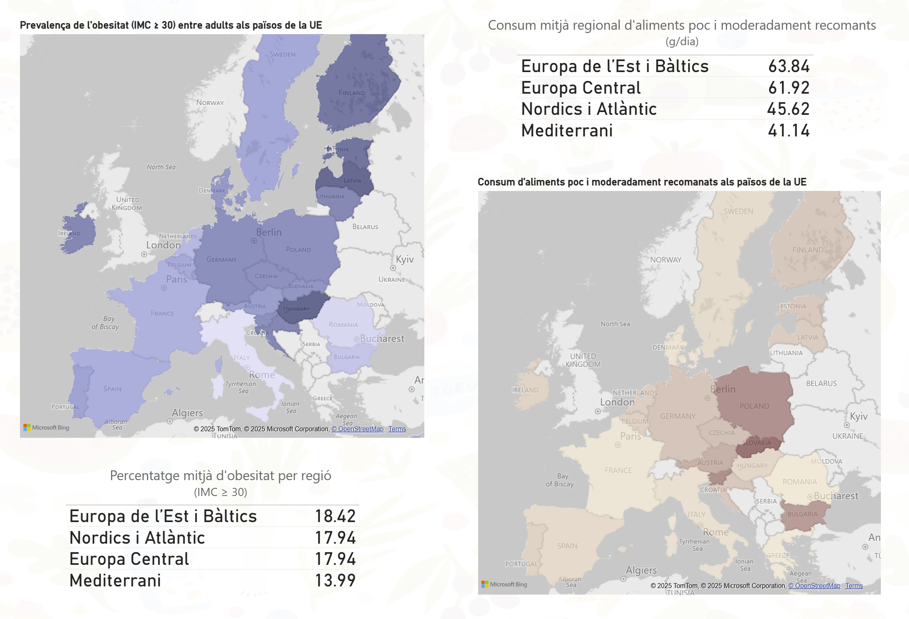

# PR2 - Visualització de Dades | UOC Master en Ciència de Dades

Aquest repositori conté els arxius de codi R, PBIX i els conjunts de dades necessaris per generar la visualització per a la PR2 de l'assignatura de Visualització de Dades.

## Contingut del repositori
- **src/**: Carpeta amb els scripts de codi R utilitzats per generar els gràfics i conjunts de dades en CSV/Excel.
- **output/**: Carpeta amb els resultats finals de l'execucció R (fitxers CSV) i PBIX.
- **README.Rmd**: Fitxer explicatiu sobre el contingut del repositori.

## Alimentació i obesitat a Europa: Com ens alimentem i quin impacte té?
Aquest projecte explora els patrons alimentaris a Europa i la seva relació amb l'obesitat.

Enllaç públic a la visualització: https://app.powerbi.com/view?r=eyJrIjoiMWUxM2ZjNDktZDBiNi00ZTAwLTkwN2ItODliNWU3ZWUzNjZmIiwidCI6ImFlYzc2MmU0LTNkNTQtNDk1ZS1hOGZlLTQyODdkY2U2ZmU2OSIsImMiOjh9

Les fonts de dades utilitzades són:

- Comprehensive Food Consumption Database: https://data.europa.eu/data/datasets/the-efsa-comprehensive-european-food-consumption-database
- Obesity Rate by Body Mass Index: https://data.europa.eu/data/datasets/a2emgcmjtmlvvwbsvalr8w

## Requisits
- Programari: R (versió 2025.05.0) i les llibreries necessàries (`dplyr`, `tidyr`, `openxlsx`, entre altres).
- Power BI Desktop (versió 2.143.1378.0)
